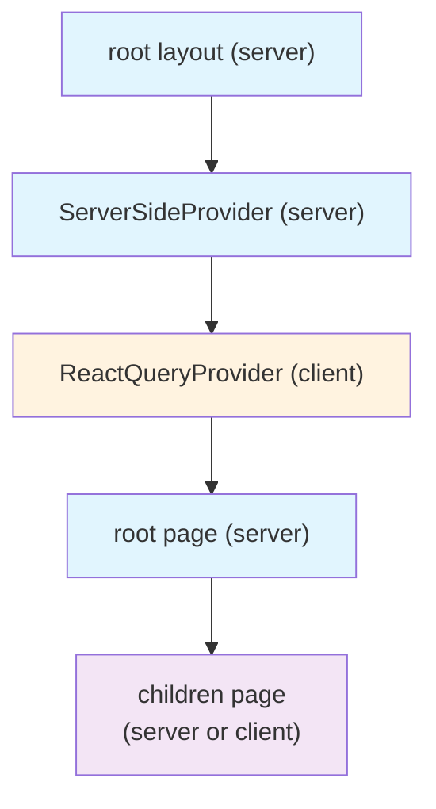
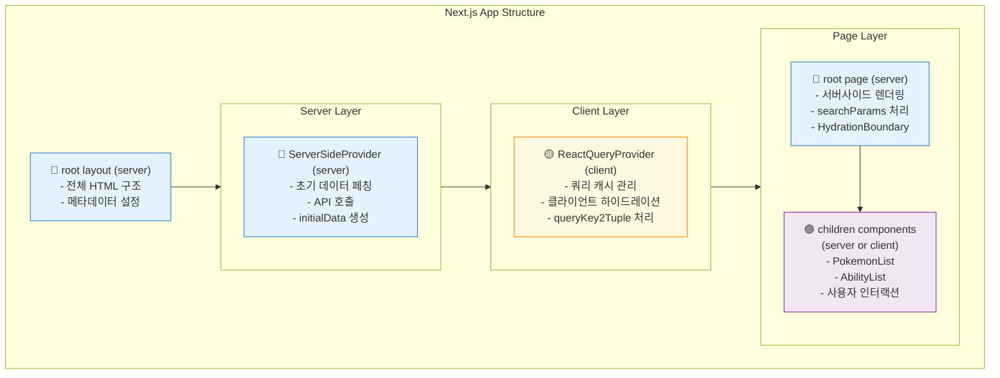

- 셀프호스팅을 할 때 서버사이드 캐시를 마련할 형편이 안 될수도 있다.
- 이럴 때는 최초 1회만 SSR을 이용하고, 이후의 캐시는 클라이언트에 저장하는 것도 방법이다.
- [[next.js 15의 app route + ssg 용 스케폴드 레시피(2025.08)]] 를 ssr 모드로 개선하는 레시피를 정리한다.
# 스탠드얼론 모드 설정
- `next.config.ts` 의 `output` 을 `standalone` 으로 설정한다.
    - `standalone` 모드는 node.js 에서 독립 실행이 가능한 빌드를 생성한다.
```diff
import type { NextConfig } from 'next'

const nextConfig: NextConfig = {
+ output: 'standalone',
  images: {
    unoptimized: true // cdn 레벨의 이미지 최적화를 사용하지 않는다
  }
}

export default nextConfig
```

# react-query 설치
- 개발도구와 구현체를 설치한다. 평이하다.
```sh
pnpm i @tanstack/react-query
```

```sh
pnpm i @tanstack/react-query-devtools -D
```

# 다중 프로바이더 설정
- 서버의 데이터를 클라이언트로 직렬화해서 보내는 것이 핵심이다.

- 실제 구현은 아래와 같은 모습이 된다.


# 하이드레이션 가능한 쿼리 프로바이더 생성
- `ReactQueryProvider` 는 클라이언트 프로바이더다.
    - react-query 자체가 클라이언트 환경에서 동작하도록 설계되었기 때문이다.
    - `useState` 안에서 초기화해서 초기화 시점을 지연하는 것이 핵심 기술이다.
- `queryKey2Tuple` 은 `prefetch` 한 `initialData` 의 키를 파싱해서 리액트 쿼리의 초기값을 제공한다.
    - 하이드레이션 실패를 막는 효과가 있다.
      `ReactQueryProvider.tsx`
```tsx
'use client'

import { FC, PropsWithChildren, useState } from 'react'

import { QueryClient, QueryClientProvider } from '@tanstack/react-query'
import { ReactQueryDevtools } from '@tanstack/react-query-devtools'

// 'query,0' 등으로 직렬화된 문자열을 숫자와 문자의 튜플로 변환
const queryKey2Tuple = (queryKey: string): (string | number)[] => {
  return queryKey.split(',').map((segment): string | number => {
    const trimmed = segment.trim()

    // 빈 문자열 처리
    if (trimmed === '') return segment

    // 정수나 부동소수점 숫자 패턴 검증
    if (/^-?\d+(\.\d+)?$/.test(trimmed)) {
      const numValue = Number(trimmed)

      if (!isNaN(numValue) && isFinite(numValue)) {
        return numValue
      }
    }

    return segment
  })
}

/**
 * SSR용 리액트 쿼리 프로바이더. 서버 데이터를 초기화하는 기능이 있음
 * @param children
 * @param initialData
 * @constructor
 */
const ReactQueryProvider: FC<
  PropsWithChildren & {
    initialData?: Record<string, unknown>
  }
> = ({ children, initialData }) => {
  const [queryClient] = useState(() => {
    const client = new QueryClient({
      defaultOptions: {
        queries: {
          staleTime: 60 * 1000
        }
      }
    })

    // SSR 데이터를 Query Cache에 미리 설정
    if (initialData) {
      Object.entries(initialData).forEach(([queryKey, data]) => {
        client.setQueryData(queryKey2Tuple(queryKey), data)
      })
    }

    return client
  })

  return (
    <QueryClientProvider client={queryClient}>
      {children}
      {process.env.NODE_ENV === 'development' && (
        <ReactQueryDevtools initialIsOpen={false} />
      )}
    </QueryClientProvider>
  )
}

export default ReactQueryProvider
```

# 서버사이드 프로바이더 생성
- 최상위에서 클라이언트 프로바이더를 하이드레이션하는 용도로 사용한다.
  `ServerSideProvider.tsx`
```tsx
import { FC, PropsWithChildren } from 'react'

import { client } from '@/api/client'
import ReactQueryProvider from '@/app/ReactQueryProvider'

/**
 * 최상위 프로바이더. 하이드레이션에 이용
 * @param children
 * @constructor
 */
const ServerSideProvider: FC<PropsWithChildren> = async ({ children }) => {
  // 최상위 하이드레이션. 최초 1회 실행된다.
  const { data } = await client.api.apiV2AbilityList({
    limit: 10,
    offset: 0
  })
  // react query 용 query key를 직렬화하는 것이 포인트
  const initialData = {
    'abilitylist,10,0': data
  }

  return (
    <ReactQueryProvider initialData={initialData}>
      {children}
    </ReactQueryProvider>
  )
}

export default ServerSideProvider
```

# next.js 의 네비게이션과 클라이언트 패치 통합
- react-router 와 DX는 비슷한데 디테일이 조금 다르다.
    - 쿼리스트링을 커스텀 훅을 사용하면 조금 나아진다.
      `PokemonList.tsx`
```tsx
'use client'

import Link from 'next/link'
import { useSearchParams } from 'next/navigation'

import { client } from '@/api/client'
import { useQuery } from '@tanstack/react-query'

const useQueryString = () => {
  const searchParams = useSearchParams()
  const params = new URLSearchParams(searchParams.toString())
  const limit = params.get('limit') || '10'
  const offset = params.get('offset') || '0'

  return {
    limit: Number(limit),
    offset: Number(offset)
  }
}

const usePrevSearchParams = () => {
  const { limit, offset } = useQueryString()

  return new URLSearchParams({
    limit: `${limit}`,
    offset: `${offset - 10}`
  })
}

const useNextSearchParams = () => {
  const { limit, offset } = useQueryString()

  return new URLSearchParams({
    limit: `${limit}`,
    offset: `${offset + 10}`
  })
}

export default function PokemonList() {
  const { limit, offset } = useQueryString()
  const { data, isLoading, isError, error } = useQuery({
    queryKey: ['pokelist', limit, offset],
    queryFn: () =>
      client.api
        .apiV2PokemonList({
          limit: Number(limit),
          offset: Number(offset)
        })
        .then((res) => res.data)
  })
  const nextSearchParams = useNextSearchParams()
  const prevSearchParams = usePrevSearchParams()

  if (isError) {
    return <>{error.message}</>
  }

  if (isLoading) {
    return <>로딩중</>
  }

  return (
    <>
      <ul>
        {data?.results?.map((item) => {
          return <li key={item.url}>{item.name}</li>
        })}
      </ul>

      <div style={{ display: 'flex', gap: 10 }}>
        {offset > 0 && (
          <Link href={`?${prevSearchParams.toString()}`}>이전페이지</Link>
        )}
        {data?.next && (
          <Link href={`?${nextSearchParams.toString()}`}>다음페이지</Link>
        )}
      </div>
    </>
  )
}
```

# 서버 데이터를 클라이언트에 하이드레이션
- 실제로 데이터를 소비하는 컴포넌트는 평이하다.
  `Abilitylist.tsx`
```tsx
'use client'

import { client } from '@/api/client'
import { useQuery } from '@tanstack/react-query'

const Abilitylist = () => {
  const { data } = useQuery({
    queryKey: ['abilitylist', 10, 0],
    queryFn: () =>
      client.api
        .apiV2AbilityList({
          limit: 10,
          offset: 0
        })
        .then((res) => res.data)
  })

  return (
    <ul>
      {data?.results?.map((item) => {
        return <li key={item.url}>{item.name}</li>
      })}
    </ul>
  )
}

export default Abilitylist
```

# 루트 레이아웃에 서버 프로바이더 배치
- `src/layout` 에 아래와 같이 배치한다.
    - DX는 크게 다르지 않다.
```diff
import type { Metadata } from 'next'

+ import ServerSideProvider from '@/app/ServerSideProvider'

import './globals.css'

import { nanumSquare } from './fonts'

export const metadata: Metadata = {
  title: 'Create Next App',
  description: 'Generated by create next app'
}

export default function RootLayout({
  children
}: Readonly<{
  children: React.ReactNode
}>) {
  return (
    <html lang="ko" className={nanumSquare.variable}>
      <body className={nanumSquare.className}>
+       <ServerSideProvider>{children}</ServerSideProvider>
      </body>
    </html>
  )
}
```

# 서버사이드 프리패치
- react query는 서버사이드 데이터를 클라이언트로 전송하는 기능을 내장하고 있다.
    - `HydrationBoundary` , `dehydrate` 가 핵심 컴포넌트이다.
      `src/page.tsx`
```tsx
import { client } from '@/api/client'
import Abilitylist from '@/app/Abilitylist'
import PokemonList from '@/app/PokemonList'
import {
  HydrationBoundary,
  QueryClient,
  dehydrate
} from '@tanstack/react-query'

// 서버사이드 프리패치
export default async function Home({
  searchParams
}: {
  // next.js 에는 page.js 에 서버사이드 컨텍스트를 prop으로 전달하는 기능이 있다.
  searchParams: Promise<{ limit: string; offset: string }>
}) {
  const params = await searchParams
  const limit = Number(params.limit || '10')
  const offset = Number(params.offset || '0')

  // 서버에서 쿼리 미리 실행
  const queryClient = new QueryClient()
  await queryClient.prefetchQuery({
    queryKey: ['pokelist', limit, offset],
    queryFn: () =>
      client.api.apiV2PokemonList({ limit, offset }).then((res) => res.data)
  })

  // react query는 서버사이드 데이터를 클라이언트로 전송하는 기능을 내장하고 있다.
  return (
    <HydrationBoundary state={dehydrate(queryClient)}>
      <div style={{ display: 'flex', flexDirection: 'column', gap: 20 }}>
        <Abilitylist />
        <PokemonList />
      </div>
    </HydrationBoundary>
  )
}
```